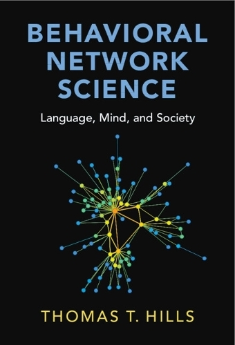

 
    
     

    **Buy:** [Amazon](https://www.amazon.co.uk/Behavioral-Network-Science-Language-Society/dp/1108793339/ref=tmm_pap_swatch_0?_encoding=UTF8&dib_tag=se&dib=eyJ2IjoiMSJ9.VIM0owZ5OvE-qQ-6er4h62unMNxQAo8cpMe-0sFx52vwk3eEV_upmcQfoQM9AfjhWl0IK91MGi8W3q-JPOobAal1ctFA8UqgCV09HF7qijMPN35S1qQBS4ovtV3rTcp972SrY1tniTJxyF6VR9_Yibz9kKs5wnP7cQkezpt2JC8AyPxzy6gYp3Ol0NFsc84JKe381o0K2UVl5l44L-11mFCfDwJlnY1dRsB3Wb5CcZ0.vBS24AYJ8GpnhEtwc1v7yRDZoAdB3KZLIX5IOtbn-Hw&qid=1713038286&sr=8-1) | [Cambridge University Press](https://www.cambridge.org/core/books/behavioral-network-science/4418BD265A869EADFC574AD07050111D) 

_Behavioural Network Science: Language, Mind, and Society_ provides a brief introduction to network science alongside an exploration of theory and problems in the behavioural sciences, including topics like language evolution, development, memory, creativity, conspiracy theories, aging, human conflict, and group problem solving. This book includes fully commented R code and data to reproduce all simulations and figures. 

You can find the code on Github [here](https://github.com/thomasthills/BehavioralNetworkScience). You can download the zipped data from [here](https://warwick.ac.uk/fac/sci/psych/people/thills/thills/sampledatafilesbns.zip)

## Table of Contents
    
####   Part I: A Brief Guide To Network Science 
- Chapter 1:  Making And Recognizing Networks 
- Chapter 2:  Network Metrics
-  Chapter 3:  Generative Network Models And Network Evolution
  
####   Part II: Language
- Chapter 4:  Zipf’s Law Of Meaning: The Degree Distribution Of The Mind 
- Chapter 5:  Network Learning: Growing A Lexicon By Degrees 
- Chapter 6:  What Is Distinctive: Exploring Edge Types In Multi-Layer Networks 
- Chapter 7:  The Small-World Spectrum: Using Small Worlds To Compare Networks 
- Chapter 8:  The Birthplace Of New Words: Identifying Node Origins 
- Chapter 9:  Agent-Based Models of Language Emergence: Structure Favors The Orangutan
  
####  Part III: Mind 
- Chapter 10:  False Memories: Spreading Activation In Memory Networks 
- Chapter 11:  Cognitive Foraging: Exploration Versus Exploitation 
- Chapter 12:  Age-Related Cognitive Decline: A Network Enrichment Account 
- Chapter 13:  Creativity: How Noisy Processes Create Novel Structure
  
####  Part IV: Society 
- Chapter 14:  Network Illusions: How Structure Misleads Us 
- Chapter 15:  Group Problem Solving: Harnessing The Wisdom Of The Crowds 
- Chapter 16:  The Segregation of Belief: How Structure Facilitates False Consensus 
- Chapter 17:  The Conspiracy Frame: Coherence Through Self-Supporting Beliefs
- Chapter 18:  The Kennedy Paradox: Games Of Conflict And Escalation 
- Chapter 19:  Fund People Not Projects: A Universal Basic Income For Research 

